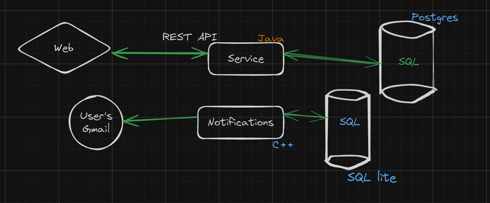

# TaskFlow

----------

+ ***User: (Id, Nickname, Password, Fist_name, Last_Name, Gmail, Post, @Null Team_id, List<Task>, Role: Enum)***
+ ***Team: (Id, Name, @Null List<User>, @Null Project_id)***
+ ***Project: (Id, Name, @Null List<Tasks>, StartDate: Date, EndDate: Date, Team_id)***
+ ***Task: (Id, Name, Descriptions, StartDate: Date, EndDate: Date, Set<User>, Priority: enum, Condition: enum, Stage: enum, Project_id)***
+ ***Customer: (Id, Nickname, Password, Fist_name, Last_Name, Gmail, List<Project>, Role: Enum)***
_@Null = can be empty while creating_

---

Enums:
1) __Priority__: High, Middle, Low
2) __Condition__: Queue, Process, Done
3) __Stage__: Function, Fix, Error

Как передавать:
__Role__: "ROLE_USER", "ROLE_ADMIN", "ROLE_CUSTOMER"
__Date__: "yyyy-MM-dd HH:mm:ss"

_Task's Life cycle_: __Analysis-Developing-Testing-Review-Relies__

---

__<u>P.S. Не сдаёмся, парни</u>__ 
